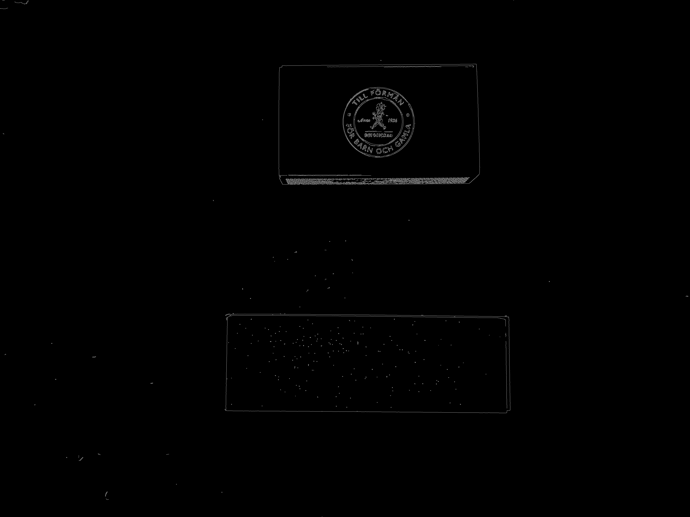

# Edge Detection Prestudy

## Description
In this project I aim to do a prestudy to investigate which edge detection algorithms suit best , finding sharp edges.
The original image that we will use to study the algorithms is the following:
  

## Results
Achieved the following results for detecting the edge. Would select canny as preferred method, due to its sharpness and simplicity to implement, as well as compute time.  
Canny edge detector
  

Laplacian edge detector

Sobel edge detector
  

Prewitt edge detector
  
## Authors and acknowledgment
José María Sabater

## License
Open

